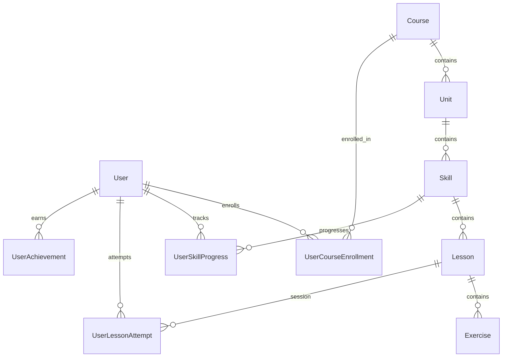

# Duolingo Web Application Clone — Fullstack Implementation

A full-stack, gamified language learning web application that accurately recreates Duolingo's core learning path, lesson player loop, gamification mechanics (XP, daily streaks, hearts system, gems), and visual design language.

---

## 🌐 Live Deployments

- 📱 **Frontend Web Application (Vercel):** [https://duolingo-dun.vercel.app/](https://duolingo-dun.vercel.app/)
- ⚙️ **Backend REST API (Render):** [https://duolingo-backend-vrcj.onrender.com](https://duolingo-backend-vrcj.onrender.com)
- 📖 **Interactive API Documentation (Swagger UI):** [https://duolingo-backend-vrcj.onrender.com/docs](https://duolingo-backend-vrcj.onrender.com/docs)

---

## 🛠️ Technical Stack

- **Frontend**: Next.js 14 (App Router, TypeScript, React 18)
- **Styling**: Tailwind CSS (v3 with custom Duolingo design tokens, 3D tactile button effects, custom keyframe animations, dark mode support)
- **Backend**: Python 3.12, FastAPI (ASGI)
- **ORM & Database**: SQLAlchemy 2.0, SQLite (file-based relational DB with explicit foreign key constraints and cascade rules)
- **Database Migrations**: Alembic
- **API Client**: Centralized typed fetch wrapper with error handling and environment-aware base URL selection

---

## 🏗️ Architecture & Monorepo Structure

The repository is organized as a clean monorepo divided into `frontend/` and `backend/`.

```text
c:/Django/scalar/
├── README.md                 # System overview, setup guide & schema documentation
├── assignment.txt            # Original assignment specifications
├── .gitignore                # Global ignore rules (Python, Node, SQLite, env)
│
├── backend/                  # FastAPI Backend Application
│   ├── main.py               # Application entrypoint, CORS, lifespan auto-seeder
│   ├── seed.py               # Idempotent database seeder (Spanish course, 3 units, 6 skills, 12 lessons, 60 exercises)
│   ├── requirements.txt      # Python dependencies
│   ├── alembic.ini           # Migration configuration
│   ├── alembic/              # Database migration scripts
│   ├── core/                 # Shared infrastructure & settings
│   │   ├── config.py         # Type-safe settings via Pydantic BaseSettings
│   │   └── database.py       # SQLAlchemy engine, session maker, naming conventions, get_db generator
│   ├── models/               # SQLAlchemy ORM Models (with explicit line-by-line comments & cascade deletes)
│   │   ├── user.py           # User model (XP, streak, hearts, gems, daily goal)
│   │   ├── course.py         # Course, Unit, and Skill models (UI colors, display order)
│   │   ├── lesson.py         # Lesson and Exercise models (5 exercise types, JSON data payload)
│   │   └── progress.py       # Enrollment, SkillProgress, LessonAttempt, Achievement models
│   ├── schemas/              # Pydantic Schemas for data validation & API contracts
│   │   ├── user.py           # User DTOs
│   │   ├── course.py         # Nested course/unit/skill learning path DTOs
│   │   ├── lesson.py         # Lesson player & exercise DTOs (sanitized output)
│   │   └── progress.py       # Progress, Leaderboard, and Profile DTOs
│   └── api/routes/           # Modular REST API Route Handlers
│       ├── health.py         # GET /health
│       ├── users.py          # GET, PATCH /api/users, POST /api/users/{id}/refill-hearts
│       ├── courses.py        # GET /api/courses, GET /api/courses/{id}/path/{user_id}
│       ├── lessons.py        # GET /api/lessons/{id}, POST start, check-answer, complete
│       ├── progress.py       # GET /api/progress/users/{id}
│       ├── leaderboard.py    # GET /api/leaderboard/
│       └── profile.py        # GET /api/profile/{id}
│
└── frontend/                 # Next.js 14 Frontend Application
    ├── package.json          # Node dependencies & scripts
    ├── tailwind.config.ts    # Custom Duolingo color palette (#58CC02, #1CB0F6, etc.), shadows, radii
    ├── .env.local            # NEXT_PUBLIC_API_URL environment configuration
    └── src/
        ├── app/
        │   ├── layout.tsx    # Root layout with Nunito font & global metadata
        │   ├── globals.css   # Duolingo component classes (btn-duo-primary, word-chip, etc.) & dark mode variables
        │   └── page.tsx      # Landing page / home UI
        └── lib/
            └── api.ts        # Typed API client for FastAPI backend communication
```

---

## 🗄️ Database Schema & Design Rationale

The database schema is explicitly designed to model Duolingo's domain logic cleanly and efficiently.



### Table Definitions & Foreign Key Constraints

1. **`users`**
   - Stores learner state including total XP, streak counter, hearts (with max cap), gems balance, and daily active date.
   - Cascades deletes to all progress, attempt, enrollment, and achievement records.

2. **`courses`**, **`units`**, **`skills`**
   - Hierarchical structure of the learning curriculum:
     - `Unit` belongs to `Course` (`ON DELETE CASCADE`).
     - `Skill` belongs to `Unit` (`ON DELETE CASCADE`).
   - `units` and `skills` include explicit hex `color` codes to support section themes identical to Duolingo.

3. **`lessons`**, **`exercises`**
   - `Lesson` belongs to `Skill` (`ON DELETE CASCADE`).
   - `Exercise` belongs to `Lesson` (`ON DELETE CASCADE`).
   - `Exercise.type` supports: `multiple_choice`, `translate_word_bank`, `match_pairs`, `fill_blank`, `type_answer`.
   - `Exercise.data` stores flexible JSON configurations specific to each exercise type.
   - Security pattern: `correct_answer` is stored in the database but **stripped** in API GET responses so learners cannot inspect network traffic to cheat.

4. **`user_skill_progress`**
   - Tracks crown levels (0–5), `completed_lessons`, and `total_lessons` per skill.
   - Enforces unique `(user_id, skill_id)` constraint.

5. **`user_lesson_attempts`**
   - Records individual learning sessions, tracking start/completion timestamps, XP earned, hearts lost, and pass/fail outcome.

6. **`user_course_enrollments`** & **`user_achievements`**
   - Enables clean multi-course scalability and achievement badge tracking.

---

## 🚀 Local Development Setup Guide

### Backend Setup (FastAPI)

1. Open a terminal in `backend/`:
   ```bash
   cd backend
   ```

2. Create and activate a Python virtual environment:
   ```bash
   python -m venv venv
   # On Windows PowerShell:
   .\venv\Scripts\Activate.ps1
   ```

3. Install backend dependencies:
   ```bash
   pip install -r requirements.txt
   ```

4. Run database migrations and seed default data:
   ```bash
   alembic upgrade head
   python seed.py
   ```

5. Start the API server:
   ```bash
   python -m uvicorn main:app --reload --port 8000
   ```
   - Interactive Swagger API Documentation: `http://localhost:8000/docs`
   - Health Check: `http://localhost:8000/health`

---

### Frontend Setup (Next.js 14)

1. Open a separate terminal in `frontend/`:
   ```bash
   cd frontend
   ```

2. Install dependencies:
   ```bash
   npm install
   ```

3. Ensure `.env.local` contains the backend URL:
   ```env
   NEXT_PUBLIC_API_URL=http://localhost:8000
   ```

4. Start the Next.js development server:
   ```bash
   npm run dev
   ```
   - Application URL: `http://localhost:3000`

---

## 🌐 Production Deployment Guide

To avoid monorepo folder routing issues (e.g. Vercel build directory confusion), follow these recommended deployment steps:

### 1. Frontend (Vercel)
- Connect your GitHub repository to Vercel.
- Under **Project Settings > Root Directory**, set it to `frontend`.
- Set Environment Variable:
  - `NEXT_PUBLIC_API_URL` = `https://your-backend-service.onrender.com`
- Framework Preset: **Next.js**

### 2. Backend (Render / Railway)
- Create a Web Service on Render / Railway pointing to your repository.
- Root Directory: `backend`
- Build Command: `pip install -r requirements.txt && alembic upgrade head && python seed.py`
- Start Command: `uvicorn main:app --host 0.0.0.0 --port $PORT`
- Environment Variables:
  - `CORS_ORIGINS` = `["https://your-app.vercel.app"]`
